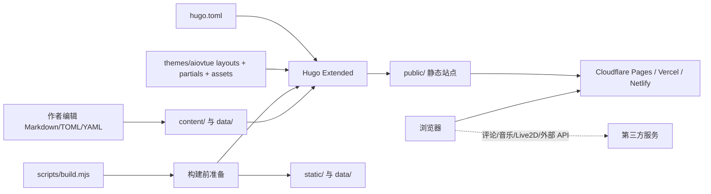
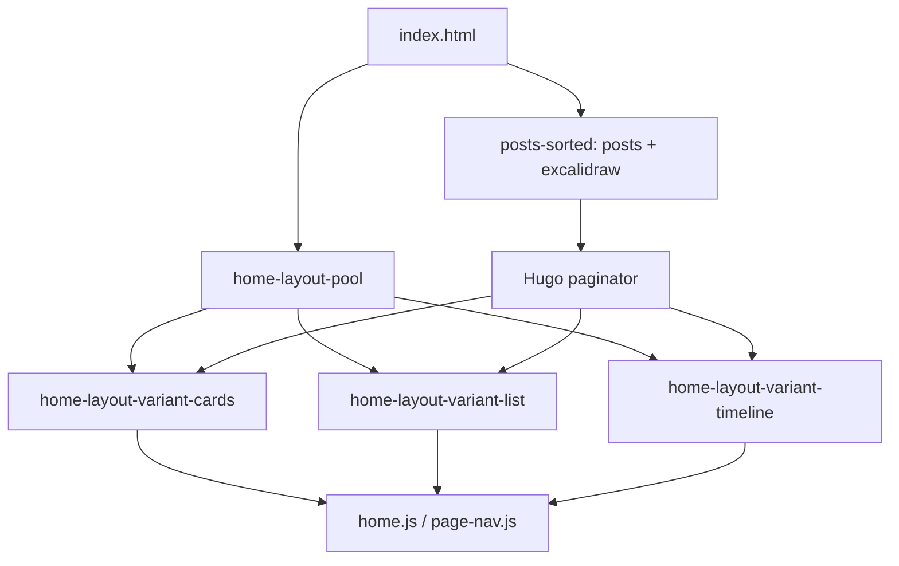
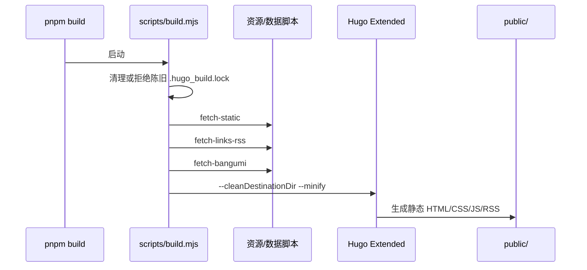

# 整体架构

## 架构风格判断

这是一个**静态站点生成器 + 主题模板 + 构建前数据准备**的单体博客，而不是运行时后端服务。判断依据：`package.json:4-9` 只定义本地 Node 脚本和 Hugo 命令；`scripts/build.mjs:89-110` 最终调用 Hugo 生成 `public/`；部署配置将 `public` 作为静态输出目录。评论、RSS、Bilibili 等外部能力通过构建期抓取或浏览器端第三方服务接入。

## 整体组件图

## 请求/渲染边界

1. 访问者请求 CDN 上已经生成的 HTML、CSS、JS 和媒体。
2. Hugo 在构建期根据内容页面的 `layout`、section、taxonomy 和主题模板选择渲染路径。
3. `baseof.html` 统一装配 head、加载动画、导航、页面主体、页脚、PJAX、搜索、音乐、Live2D 和脚本（`themes/aiovtue/layouts/_default/baseof.html:1-19`）。
4. 页面主体由首页、single、gallery、links、moments、bangumi、comment、search 等模板分别处理。
5. 浏览器端 JS 再负责交互；评论和部分媒体/数据可能在运行时请求外部服务。

## 页面渲染路由

| 内容/页面 | 模板入口 | 主要数据 |
|---|---|---|
| 首页 | `layouts/index.html:1-111` | `posts` 与 `excalidraw` 合并、排序、分页；Hero 与布局池 |
| 普通文章 | `layouts/_default/single.html:1-29` | Markdown 正文、目录、摘要、赞助、版权、上下篇、评论 |
| Excalidraw | `layouts/excalidraw/list.html`、`single.html` | Page Bundle 的 `.excalidraw` 资源和查看器脚本 |
| 相册 | `layouts/gallery/list.html`、`single.html` | `_index.md` 的 albums 列表、相册 front matter 和照片 |
| 友链 | `layouts/_default/links.html:1-18` | `data/links.yaml`、可选 `data/links_rss.json` |
| 动态 | `layouts/_default/moments.html:1-48` | `content/moments/*.md`，按日期倒序并前端分批加载 |
| 追番 | `layouts/_default/bangumi.html:1-8` | `data/bangumi.json`，由构建前 Bilibili API 拉取 |
| 留言 | `layouts/_default/comment.html:1-33` | 信封资源、评论 partial 和 `params.envelope` |
| 搜索 | `layouts/_default/search.html` | posts/excalidraw 的标题、URL、摘要、标签/分类序列化到页面 |

## 启动组装

`baseof.html` 是所有普通页面的装配点。它先调用 `head.html`，再按顺序挂载 `loader`、`navbar`、内容 block、`footer`、`pjax-loader`、`search-modal`、`music-player`、`live2d-widget` 和 `scripts`。模板通过 `params` 和当前 Page 的 Front Matter 判断功能是否启用，因此**配置与模板之间存在运行时条件分支**，静态依赖图不能覆盖所有浏览器行为。

## 首页控制流

`layouts/index.html:2-27` 先取得布局池，再合并 `posts` 和 `excalidraw` 页面并排序；随后建立分页和推荐池。`layouts/index.html:28-98` 根据 `cards`、`list`、`timeline` 选择 partial，`params.home.desktopListColumns` 控制 list 的单/双列，`params.home.mobileCardsLayout` 控制移动端变体。该结构允许同一首页在构建时输出多个隐藏变体，再由配置/前端选择展示。

## 构建流程

`build.mjs:21-47` 检查 Hugo 进程和锁文件；`build.mjs:88-110` 依次执行三个准备脚本，再以清理目标目录和压缩选项调用 Hugo。部署环境可通过 `CF_PAGES`、`RENDER`、`VERCEL` 触发临时下载的 Linux Hugo Extended（`build.mjs:49-77`）。

## 状态、持久化与外部边界

- **持久化内容**：Git 中的 Markdown、TOML、YAML、静态文件。
- **构建派生数据**：`data/links_rss.json`、`data/bangumi.json`；脚本会覆盖这些 JSON，不是用户手工编辑的主数据源。
- **构建缓存/产物**：`.hugo_build.lock`、`resources/`、`public/`；构建脚本主动处理锁文件，Wiki 不把它们当业务源代码。
- **浏览器状态**：PJAX、搜索、相册密码门、评论和播放器状态由 JS/第三方服务管理；友链 `source=remote` 时，`remote-links.js` 每次挂载通过 `fetch` 实时加载远端 JSON/YAML，并转换为统一的 `linkGroups`，静态 HTML 不包含本地友链卡片。静态分析未验证所有运行时组合的一致性。
- **安全边界**：相册 `encrypted/password` 位于前端可见的 HTML 属性（`themes/aiovtue/layouts/gallery/single.html:1-2`），因此只能视为轻量展示门，不应当作机密保护。仓库现有 `content/gallery/jiamio/index.md` 含示例密码，本文档不复制该值。
