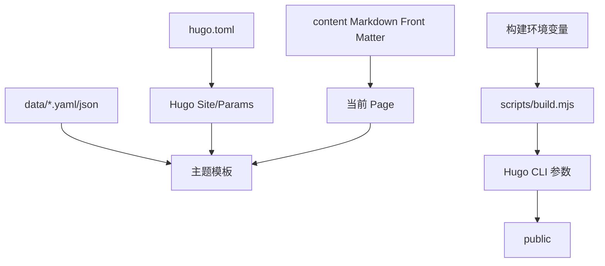

# 配置说明

## 配置层级与加载顺序

1. `hugo.toml` 提供站点级配置、渲染规则和 `.Site.Params`。
2. 各 Markdown 的 Front Matter 覆盖/补充当前页面属性，例如 `layout`、`cover`、`comment`、`math`。
3. `data/links.yaml`、`data/bangumi.json`、`data/links_rss.json` 由相应模板或脚本读取。
4. 构建环境变量由 Node 构建脚本读取，必要时转成 Hugo 的 `--baseURL`。

## `hugo.toml` 关键配置

| 区域 | 关键字段 | 用途 |
|---|---|---|
| 站点 | `baseURL`、`locale`、`defaultContentLanguage`、`title`、`theme` | 绝对 URL、语言、站点标题和主题选择 |
| SEO/输出 | `enableRobotsTXT`、`sitemap`、`outputs` | robots、sitemap、HTML/RSS 输出 |
| 内容渲染 | `markup.goldmark`、`markup.highlight`、TOC | HTML、LaTeX passthrough、代码高亮、目录 |
| taxonomy | `taxonomies.category/tag` | 分类与标签 URL |
| `params.home` | `layout`、`desktopListColumns`、`mobileCardsLayout`、分页数量 | 首页布局和批处理 |
| `params.links` | `layout`、`source`、`remoteURL`、`applicationAPI`、`rssEnable`、`footerEnable` | 友链卡片数据源、浏览器端 friendlink-verify 方式四申请 API、RSS 展示；`source=remote` 时浏览器实时读取 `remoteURL`，支持 Blog API JSON 和 Hexo `class_name/class_desc/link_list` YAML；卡片可选 `tags` 字段 |
| `params.bangumi` | `enable`、UID | 追番构建开关和 Bilibili 用户 |
| `params.comment` | `provider` | `twikoo`/`waline` 分流 |
| `params.waline/twikoo` | server URL/env ID | 评论服务端配置；值不应写入 Wiki |
| `params.menu.main` | name/url/icon/weight/items | 顶栏和侧栏导航 |
| `params.music` | enable、API 列表、server/type/id | 音乐播放器 |
| `params.live2d` | enable、widget、cdnPath | Live2D 组件和模型库 |
| `params.mouse` | enable、path、scale | 动态鼠标 manifest 和显示比例 |
| `params.effects` | enable、type、mobile、script | 背景特效 |
| `params.pjax/search` | enable 和时间/阈值 | 无刷新跳转和全文搜索 |

完整默认值与注释以仓库 `hugo.toml` 为准；本页只提取影响架构的字段。

## 页面 Front Matter

### 普通文章

`content/posts/*.md` 使用 `title`、`description`、`date`、可选 `lastmod`/`cover`/`categories`/`tags`/`weight`。`title` 和 `date` 是维护文章列表所需的核心字段；`comment: false`、`math: true`、`indent: false`、`musicPlayer: false` 等单页开关由主题 partial 读取。

### 专用页面

- `about.md`：`layout: about`。
- `links.md`：`layout: links`，数据转移到 `data/links.yaml`。
- `comment.md`：`layout: comment`。
- `search.md`：`layout: search`。
- `bangumi.md`：`layout: bangumi`，当前页面关闭评论。
- `gallery/_index.md`：`layout: gallery`，`albums` 控制相册清单。
- `moments/_index.md`：`layout: moments`，cascade 隐藏子页面的普通列表渲染。
- `excalidraw/_index.md`：栏目页；子目录是 Page Bundle。

## 环境变量类别

仅记录名称和用途，不记录值：

| 变量 | 读取位置 | 用途 |
|---|---|---|
| `HUGO_VERSION` | `scripts/build.mjs:9`、平台配置 | 临时 Hugo 下载版本，默认 `0.163.3` |
| `CF_PAGES`、`RENDER`、`VERCEL` | `build.mjs:11-18` | 判断是否使用临时 Linux Hugo |
| `CF_PAGES_URL`、`RENDER_EXTERNAL_URL`、`GITHUB_PAGES_URL`、`URL`、`DEPLOY_PRIME_URL` | `build.mjs:101-106` | 为本次构建覆盖 `baseURL` |
| `MOUSE_SOURCE_DIR` | `compress-mouse-assets.mjs:18` | ANI 源目录 |
| `MOUSE_WEBP_QUALITY` | `compress-mouse-assets.mjs:20` | 鼠标 WebP 质量 |
| `MOUSE_SCALE` | `compress-mouse-assets.mjs:22-35` | 鼠标缩放；优先于 `hugo.toml` |
| `HUGO_EXTENDED`、`HUGO_ENV`、`NODE_VERSION` | 平台 TOML/JSON | 平台构建环境声明 |

## 环境差异

- 本地 `build.mjs` 直接使用系统 `hugo`；特定云平台使用脚本下载的 Linux Hugo。
- 本地 `dev` 含草稿且启用热开发；生产构建使用 `--cleanDestinationDir --minify`。
- `CF_PAGES` 等变量只在部署环境触发 Bundled Hugo；若 CI 未设置，可能依赖平台预装命令。

## 安全注意事项

- 不要在文档、日志或提交中复制评论服务密钥、Token、Cookie、私钥和完整连接串。
- `hugo.toml` 当前包含外部服务 URL/UID 等公开配置；部署前检查这些 URL 是否为真实服务，示例地址不要误用于生产。
- 相册密码会进入前端页面属性，不能保护机密内容。
- `markup.goldmark.renderer.unsafe = true` 允许正文嵌入 HTML；只有信任的作者内容应使用该能力。
