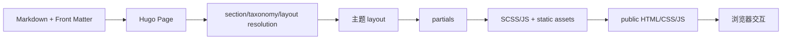
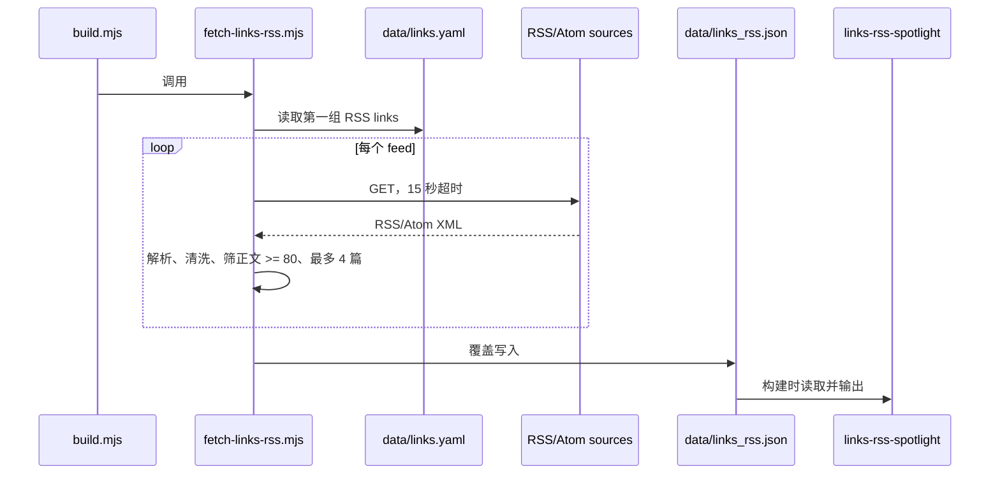

# 数据与关键流程

## 核心内容模型

| 数据 | 来源 | 关键字段/结构 | 消费方 |
|---|---|---|---|
| 文章 | `content/posts/*.md` | `title`、`date`、`description`、`cover`、`categories`、`tags`、`lastmod`、`weight` | 首页、single、搜索、归档、taxonomy |
| 画板 | `content/excalidraw/<slug>/index.md` + `.excalidraw` | Page Bundle、标题、日期、封面、类别/标签 | 首页、Excalidraw 列表/查看器 |
| 相册 | `content/gallery/<slug>/index.md` | `cover`、`desc`、`location`、`encrypted`、`photos[]`；每张照片含 URL/date | 相册列表、相册查看器 |
| 动态 | `content/moments/*.md` | `date` + Markdown/图片正文 | moments 模板和前端分批加载 |
| 友链 | `data/links.yaml` 或远程 JSON/YAML | 本地/Blog API 使用 `linkGroups[].links[]`；Hexo YAML 使用 `class_name/class_desc/link_list[]`，字段映射为 `name/link/avatar/descr/feeds/friendslink/siteshot/tags` | 友链卡片、RSS 构建脚本；tags 由卡片组件展示 |
| 追番派生数据 | `data/bangumi.json` | `wantWatch`、`watching`、`watched` 条目数组 | `bangumi-board` |
| 友链 RSS 派生数据 | `data/links_rss.json` | `updatedAt`、`feeds[]`、每 feed 的 articles | `links-rss-spotlight` |

## 文章与页面渲染流程

首页显式读取 `posts` 与 `excalidraw` section，再排序和分页；普通文章经过 `single.html`，在正文后依次输出赞助、版权、导航和评论。单篇可用 `comment: false` 关闭评论，这个判断在 `single.html:17-19` 和 gallery single 中都有体现。

## 构建期友链 RSS 流程

失败策略是逐 feed 警告并跳过，最终仍写入可能为空的 JSON；解析函数使用正则，不是完整 XML 解析器。

## 构建期 Bilibili 追番流程

`scripts/fetch-bangumi.mjs:93-115` 对每个状态先用 `ps=1` 取得总量，再按 24 条分页请求。`fetchJson:64-91` 为每次请求设置 15 秒超时，并在失败时最多重试三次。`normalizeItem:43-62` 将原始条目转换为主题需要的字段；三种状态最终写入 `data/bangumi.json`。如果功能关闭或 UID 缺失，则通过 `writeEmptyBangumi` 写空数据。

## 相册媒体流程

1. `content/gallery/_index.md` 的 `albums` 指定要展示的 slug。
2. `gallery/list.html:7-16` 用 `.GetPage("gallery/<slug>")` 找到相册页面并渲染卡片。
3. 相册 single 模板读取 front matter，若 `encrypted` 为真则把密码门状态写入 HTML 属性。
4. `gallery-post/viewer.html` 及其 `resolve-media`、`parse-content` partial 组织照片展示；浏览器 JS 负责查看器交互。

当前密码门是客户端逻辑：密码或可验证信息会进入页面输出，因此不能用于保护真正的私密照片。

## 搜索流程

`search.html:2-15` 只收集 posts/excalidraw，为每页输出 title、relPermalink、cover、date、tags、categories 和 excerpt；页面输入框和搜索逻辑由 `search-page.js`/`search-modal.html` 配合 `Fuse.js`（从主题资源/模板引用推断，具体打包方式待确认）。搜索索引随静态站点构建，不需要数据库。

## 交互/外部请求边界

- 友链实时源：当 `params.links.source = 'remote'` 时，友链页容器由 `remote-links.js` 使用 `fetch(..., { cache: 'no-store' })` 请求 `remoteURL`；失败不回退本地数据，显示重试状态。
- 评论：Twikoo/Waline 由 `comment-section` 和 `comments.js` 接入。
- 播放器：`params.music` 提供 Meting API 列表、平台和歌单 ID；浏览器端解析和播放。
- Live2D：模板按 `params.live2d.enable` 加载外部 widget/CDN。
- 背景效果/鼠标：使用 `static/vendor/yzhanweather/` 和 `static/mouse/tuantuanma/manifest.json` 等本地资源。
- 友链 RSS/Bilibili：在构建时请求，不是浏览器请求。

## 错误、重试与一致性

| 流程 | 错误处理 | 一致性风险 |
|---|---|---|
| Hugo 构建 | 子进程非零退出即终止 | 外部准备脚本已写部分文件时可能留下新旧混合数据，需检查脚本写入时机 |
| 友链 RSS | 单 feed 失败跳过，最终 JSON 仍写出 | 内容新鲜度依赖每次构建；feeds 顺序和解析格式影响结果 |
| Bilibili | 单状态失败警告并将该状态置空；单请求重试 | 某状态可能为空但整体构建继续，页面看起来像没有该状态数据 |
| 相册 | 未发现服务端鉴权 | `encrypted/password` 仅客户端门，不能提供机密性 |
| 评论/外部组件 | 运行时由第三方服务决定 | 外部服务不可用不应阻断静态 HTML，但会影响功能 |

未发现数据库、消息队列、服务端 API、任务队列或事务一致性实现。
