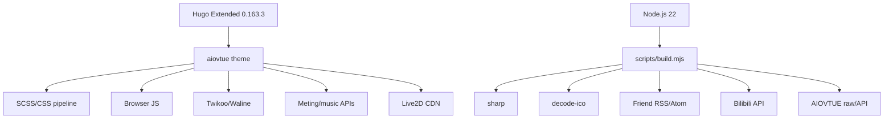

# 依赖关系

## 内部依赖矩阵

| 来源 | 依赖 | 关系证据 | 说明 |
|---|---|---|---|
| `content/posts/`、`content/excalidraw/` | `layouts/index.html` | `index.html:3-8` 按 section 读取并排序 | 首页把两类内容统一成文章流 |
| `content/*` Front Matter | `_default`/专用 layout | 各页面 `_index.md`/单页的 `layout` 字段 | 模板选择由内容元数据驱动 |
| `hugo.toml` | 全部主题 partial | `baseof.html` 和各 partial 使用 `.Site.Params` | 参数是主题的主要配置 API |
| `data/links.yaml` | `links-preview`、`fetch-links-rss` | `layouts/_default/links.html:7-10`；脚本读取 YAML | 同一数据源同时服务页面和构建脚本 |
| `data/links_rss.json` | `links-rss-spotlight` | `links.html:7-9` 条件调用 | 构建期派生数据，可能因网络失败为空 |
| `data/bangumi.json` | `bangumi-board` | `layouts/_default/bangumi.html:5` | Bilibili API 的归一化结果 |
| `scripts/build.mjs` | 三个 fetch 脚本 + Hugo | `build.mjs:93-110` | 顺序依赖，前一步失败阻断后一步 |
| `themes/aiovtue/layouts` | `themes/aiovtue/assets/js/css` | partials 和页面模板引用资源 | 模板输出决定浏览器功能启用 |

## 外部依赖

| 依赖 | 类型 | 版本/来源 | 用途与风险 |
|---|---|---|---|
| Hugo Extended | 构建时 | 本地要求 0.120+；云端配置 0.163.3 | Markdown、模板、SCSS、RSS 和静态输出；版本不一致可能改变模板行为 |
| Node.js | 构建时 | Netlify 声明 22 | 执行 ESM 脚本和依赖 |
| pnpm/npm | 开发/CI | lockfile 同时存在 `pnpm-lock.yaml`、`package-lock.json` | 当前文档和平台配置优先 pnpm，但 Vercel 使用 npm；包管理器一致性待团队确认 |
| `sharp` | 构建工具 | `^0.34.5` | 鼠标 ANI 帧缩放和 WebP 编码；原生模块安装需构建权限 |
| `decode-ico` | 构建工具 | `^0.4.1` | 解析 ICO 帧，供鼠标资源脚本使用 |
| Bilibili API | 构建期网络 | `api.bilibili.com/x/space/bangumi/follow/list` | 追番数据；限流、UID 可见性和网络失败会影响数据新鲜度 |
| 友链 RSS/Atom | 构建期网络 | `data/links.yaml` 第一组 `rss` 字段 | 友链动态；站点格式不标准时正则解析可能丢字段 |
| AIOVTUE GitHub raw/API | 构建期网络 | `fetch-missing-static.mjs` 中固定 URL | 缺失信封和字体资源；上游变更会导致构建失败 |
| Twikoo/Waline | 浏览器运行时 | URL 来自 `hugo.toml` | 评论和/或文章访问统计；当前 provider 为 Twikoo，配置值应在部署前检查 |
| Meting API/音乐平台 | 浏览器运行时 | `params.music.apis` | 解析歌单/歌曲；多个 API 顺序回退但依赖外部可用性 |
| Live2D Widget/CDN | 浏览器运行时 | `params.live2d.widget/cdnPath` | 看板娘模型和脚本；外部资源可用性、隐私和性能需评估 |
| 外部图片/视频 CDN | 内容/运行时 | Front Matter、`static/` 和配置中的 URL | 封面、相册和 Hero；URL 失效会产生空媒体 |

## 依赖图

## 循环依赖与升级注意事项

- 静态扫描未发现传统包级循环依赖；Hugo partial 的动态调用和浏览器脚本事件绑定可能形成运行时耦合，不能仅靠 import 图排除。
- `hugo.toml` 的 `params` 是主题 API。升级主题时优先比较 `theme.toml`、partials 读取的参数以及 `content` Front Matter。
- `package-lock.json` 和 `pnpm-lock.yaml` 同时存在，且 README 推荐 pnpm；建议确认 CI 的唯一包管理器，避免两套 lockfile 漂移。
- 云端环境使用 Linux 临时 Hugo，而本地可能使用系统 Hugo；模板/SCSS 版本差异应在 CI 中锁定。
- 网络抓取属于构建硬依赖。若需要可重复部署，应考虑缓存、失败降级策略或把数据更新与站点构建解耦（这是建议，不是当前实现）。
