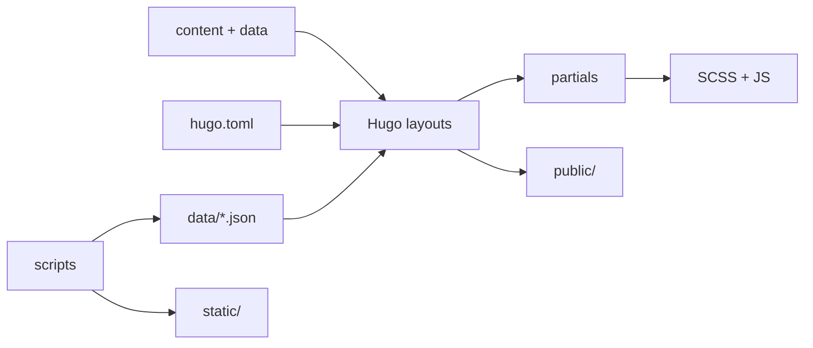

# 模块说明

## 内容与页面模块

**职责**：以 Hugo 内容树表达文章、独立页面、栏目、动态、相册和画板。主要证据是内容目录和模板入口的配对，而非仅凭目录命名。

| 子模块 | 入口/数据 | 关系证据 | 维护要点 |
|---|---|---|---|
| 文章 | `content/posts/*.md` | 首页 `layouts/index.html:3-8` 读取 `Section=posts`；single 模板渲染正文 | Front Matter 的 `title/date` 应稳定；分类/标签影响 taxonomy |
| Excalidraw | `content/excalidraw/<slug>/index.md` + `.excalidraw` | `hugo.toml:82-85` 注册媒体类型；首页把 section `excalidraw` 与 posts 合并 | Page Bundle 资源和查看器脚本需同步 |
| 独立页 | `content/about.md`、`links.md`、`comment.md`、`search.md`、`bangumi.md` | Front Matter 的 `layout` 直接选择 `_default` 模板 | 页面壳与 `data/` 数据分离 |
| 栏目页 | `content/archives/`、`categories/`、`tags/` | `_index.md` 加 layout/icon；Hugo taxonomy 自动生成 term 页 | taxonomy 名称与 `hugo.toml:50-53` 保持一致 |
| 动态 | `content/moments/*.md` | `moments.html:2-10` 按日期倒序；`_index.md` cascade 让子页使用列表逻辑 | 每条动态至少提供 `date`；图片路径需可访问 |
| 相册 | `content/gallery/_index.md` + 子目录 | `gallery/list.html:7-16` 读取 albums 或子页；single 使用照片数据 | `encrypted` 不是安全边界；远端照片 URL 需长期有效 |

## AIOVTUE 主题模块

主题是本仓库最主要的运行时 UI 模块。`baseof.html:4-17` 统一装载其 partial；页面模板再通过 partial 组合具体功能。

| 模块 | 代表文件 | 输入/输出与关系 |
|---|---|---|
| 页面骨架 | `layouts/_default/baseof.html`、`partials/head.html`、`footer.html` | 读取全局 `params`，输出公共 HTML 壳和资源引用 |
| 首页布局 | `layouts/index.html`、`partials/home-layout-variant-*.html` | 接收 Page 列表和 paginator，输出 cards/list/timeline 变体 |
| 文章渲染 | `layouts/_default/single.html`、`partials/post-*.html` | 接收单 Page；输出正文、目录、版权、赞助、评论和导航 |
| 友链 | `layouts/_default/links.html`、`partials/links-preview.html`、`links-rss-spotlight.html` | 读取 `data/links.yaml` 与可选 RSS JSON；输出友链卡片和动态聚合 |
| 相册/画板 | `layouts/gallery/*`、`layouts/excalidraw/*`、对应 `assets/js`/partials | 将 Page Bundle 元数据和媒体转成交互查看器 |
| 互动组件 | `assets/js/{comments,search,navbar,pjax-loader,music-player,live2d-widget,site-effects}.js` | 页面加载后绑定 DOM 事件或请求外部服务 |
| 样式 | `themes/aiovtue/assets/css/` | 按功能拆分变量、文章、相册、评论、播放器等样式，经 Hugo Pipes 输出 |

## 构建脚本模块

### `scripts/build.mjs`

构建编排器。证据：`build.mjs:21-47` 处理锁文件和 Hugo 进程，`build.mjs:89-110` 顺序运行准备步骤和 Hugo。被 `pnpm build`、`pnpm build:cf` 调用。

### 静态资源准备

`scripts/fetch-missing-static.mjs:1-70` 只下载缺失的信封图片和字体文件；它的幂等条件是目标文件已存在则跳过。下载源为 AIOVTUE GitHub raw/API，失败会使构建前置步骤抛错。

### 友链 RSS

`scripts/fetch-links-rss.mjs:1-249` 从 `data/links.yaml` 第一组链接解析 RSS 地址，使用 15 秒超时抓取 RSS/Atom，提取标题、链接、正文、摘要和封面，最多保留 4 篇且正文至少 80 字，再写入 `data/links_rss.json`。`scripts/lib/links-rss-config.mjs` 控制是否启用；静态分析未访问实际订阅源。

### Bilibili 追番

`scripts/fetch-bangumi.mjs:1-150` 根据 `params.bangumi` 中的 UID，按想看/在看/看过三种状态请求 Bilibili API，分页大小 24，最多重试 3 次，每次请求超时 15 秒，然后规范化封面、评分、播放量和集数写入 `data/bangumi.json`。配置缺失或关闭时写空数据。

### 鼠标资源压缩

`scripts/compress-mouse-assets.mjs:1-228` 是手工/资源维护脚本，不在 `build` 默认链路中。它读取 `.ani` 文件，使用 `decode-ico` 解码、`sharp` 缩放为 WebP，并根据 `mouse-style-rules.mjs` 生成带热点和关键帧的 `static/mouse/tuantuanma/manifest.json`。默认源路径是本机路径，跨环境运行前必须设置 `MOUSE_SOURCE_DIR`。

## 部署适配模块

| 平台 | 配置 | 关键行为 |
|---|---|---|
| Cloudflare Pages | `wrangler.toml:1-10`、`netlify.toml:1-8` 注释 | 输出 `public`；构建命令为 `pnpm run build`；Netlify 配置固定 Hugo Extended 0.163.3 |
| Vercel | `vercel.json:1-13` | `npm run build`，输出 `public`，声明 Hugo 版本环境变量 |
| Netlify | `netlify.toml:1-8` | `pnpm run build`，输出 `public`，Node 22 |

## 依赖方向与维护风险

- 内容模块依赖主题模板约定的 Front Matter 字段；字段改名需同时更新模板。
- 主题 partial 之间通过 Page、Site.Params 和 `dict` 上下文传值，Go Template 的动态性使静态分析可能遗漏字段错误。
- 构建数据脚本依赖外部 API，构建可重复性弱于纯静态内容构建。
- `public/`、`resources/` 和 `data/*.json` 的生成/缓存边界需要团队确认，尤其是是否应在 CI 前清理或提交。
